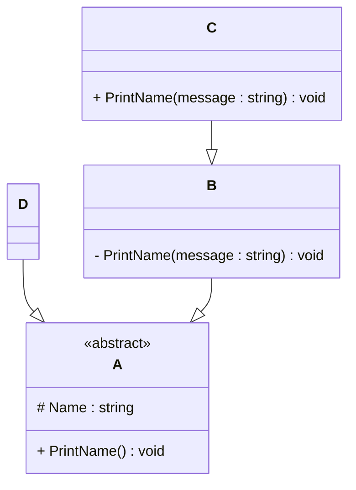

# Programming Test

This test was composed to create a general overview of your knowledge regarding general programming and how it fits with the needs in our lab. Please try to answer all questions using your own knowledge and in your own words. If you get stuck on one of the exercises, still try to give a short answer.

---

## Exercise 1

### Task
Write a program in the language of your choice where:

1. The iteration number (starting from 1), followed by a random number between 1 and 100, is printed 100 times.
2. After every 5 iterations, write an additional separator (e.g., `---`).
3. Write “Lucky number!” after every random number that is divisible by 7.

> Try to keep the procedure as short as possible.

import random

# Loop from 1 to 100
for i in range(1, 101):
    rand_num = random.randint(1, 100)  # Random number between 1 and 100
    output = f"{i}: {rand_num}"

    # Check for divisibility by 7
    if rand_num % 7 == 0:
        output += " - Lucky number!"

    print(output)

    # Print separator every 5 iterations
    if i % 5 == 0:
        print("---")

## Exercise 2

### 1. **What is your understanding of the term “Design Patterns”?**  
Design Patterns are general, reusable solutions to common software design problems. They are not specific pieces of code, but templates or blueprints that can be adapted to solve issues in different situations. Think of them as best practices refined over time by experienced developers. They help make code more maintainable, scalable, and easier to understand.

### 2. **Explain the MVC Pattern**  
   - What does MVC stand for?
     MVC stands for Model-View-Controller.
     
   - Explain the pattern in detail. -
     Model:
     The Model handles the data and business logic. It manages the state of the application and communicates with the database or other storage layers.
     View:
     The View is responsible for the presentation layer. It displays data from the Model to the user and sends user commands to the Controller.
     Controller:
     The Controller acts as an intermediary between the Model and View. It processes user input from the View, updates the Model, and returns updated output to the View.
     
   - What are some use cases for this framework?
     Web applications like those built with Django, Ruby on Rails, or ASP.NET MVC.
     Mobile apps using frameworks like SwiftUI or Android's Jetpack.
     Desktop apps with GUI frameworks such as Qt or JavaFX.

### 3. **List three other design patterns**  
A. Singleton Pattern
Purpose: Ensures a class has only one instance and provides a global point of access to it.
Use Case: Configuration manager, logging service, or database connection pool.
How I’ve Used It: I used the Singleton pattern in a Java application to ensure there was only one instance of the logging system throughout the app.

B. Observer Pattern
Purpose: Defines a one-to-many dependency between objects. When one object changes state, all its dependents are notified.
Use Case: Event systems, GUIs, pub-sub systems.
How I’ve Used It: In a stock-trading app where multiple charts had to update in real time when stock prices changed.

C. Factory Pattern
Purpose: Provides a way to create objects without specifying the exact class.
Use Case: UI components, document readers (PDF, DOC, TXT), or cross-platform development.
How I’ve Used It: I used the Factory pattern to generate different UI themes (dark/light) based on user preference.

****
---

## Exercise 3

### 1. **Implementation Task**  
   Based on the class diagram below, provide an implementation in any object-oriented programming language of your choice.
   

from abc import ABC, abstractmethod

# Abstract class A
class A(ABC):
    def __init__(self, name: str):
        self._name = name  # protected member

    @abstractmethod
    def PrintName(self):
        pass

# Class B, inherits from A
class B(A):
    def __init__(self, name: str):
        super().__init__(name)

    def __PrintName(self, message: str):  # private method
        print(f"{message}: {self._name}")

    def PrintName(self):  # public override
        self.__PrintName("From B")

# Class C, inherits from B
class C(B):
    def __init__(self, name: str):
        super().__init__(name)

    def PrintName(self, message: str):  # method overloading in a dynamic way
        print(f"{message}: {self._name}")

# Class D, inherits from A
class D(A):
    def __init__(self, name: str):
        super().__init__(name)

    def PrintName(self):
        print(f"Name in D: {self._name}")

### 2. **Key Questions**  
   - Are you able to directly create a new instance of `ObjectA`? Please explain your answer.
     No, you cannot instantiate class A directly because it is an abstract class (indicated by <<abstract>> in the diagram and the use of @abstractmethod in code). Abstract classes serve as templates and must be subclassed to be used.
     
   - Given an instance of `ObjectC`, are you able to call the method `PrintMessage` defined in `ObjectB`? Please explain your answer.
     Yes, but only if it is accessible. In this case:
The method PrintMessage (shown as - PrintName(message: string)) in class B is private (denoted by -), so it is not accessible from outside B or from C.
However, if B had declared it as protected or public, then C could access it (e.g., via super().PrintName(message) in Python).
In our implementation, class C defines its own PrintName(message) method instead.

   - Try to explain as many key features of object-oriented programming as you can find in this example.
     Abstraction: Class A is abstract, enforcing a contract for its subclasses.
Encapsulation: The name field is protected, and private methods are hidden.
Inheritance: Classes B, C, and D all inherit from A.
Polymorphism: PrintName() behaves differently depending on which class implements it.
Method Overriding: Subclasses redefine the behavior of the PrintName() method.
Method Overloading (conceptual in Python, syntactic in Java/C++): Class C defines a version of PrintName that takes a parameter.

---

## Exercise 4

### Maintaining and Expanding Software for Component Validation

This exercise focuses on strategies for working with existing code bases and ensuring the software remains maintainable as new features and requirements are introduced.

### 1. **Working with Existing Code**  
- How would you approach understanding and contributing to an existing code base with minimal disruption?
  Read the documentation and comments first, if available.
Explore high-level structure using architectural diagrams, README files, or entry-point scripts to understand how modules interact.
Use static analysis tools or IDE features to trace method calls and dependencies.
Set breakpoints or use logging to trace runtime behavior.
Begin with small, non-invasive changes (e.g., fixing typos or small refactors) to get comfortable with code flow.

- What practices would you follow to ensure your changes integrate well with the current structure?
  Follow existing coding standards (naming conventions, formatting, etc.).
Write unit and integration tests for the new functionality.
Use feature branches and version control best practices (pull requests, reviews).
Avoid duplication—reuse existing utilities and patterns.
Run all existing tests before and after changes to ensure nothing breaks.

### 2. **Ensuring Maintainability**  
- What techniques would you use to keep the code base clean, modular, and easy to maintain as new features are added?
  Single Responsibility Principle (SRP): Keep classes and methods focused.
Modular design: Break large components into smaller, reusable parts.
Dependency Injection to decouple modules and enable easier testing.
Use interfaces or abstract classes where flexibility is needed.
Regular code reviews and refactoring to keep technical debt low.

- How would you handle code documentation and testing to support long-term maintainability?
  Write docstrings or comments for all public methods and complex logic.
Maintain a developer wiki or in-code documentation (e.g., using Sphinx for Python).
Prioritize unit tests, then add integration and end-to-end tests.
Use test coverage tools to ensure new code is tested.
Adopt Test-Driven Development (TDD) where feasible for critical modules.

### 3. **Balancing Flexibility and Stability**  
- How would you design or refactor the software to make it flexible for future changes while ensuring the existing functionality remains stable?
  Use interfaces and abstractions to allow components to evolve independently.
Apply the Open/Closed Principle—open for extension, closed for modification.
Encapsulate behavior behind well-defined APIs.
Separate configuration and behavior using strategy pattern or feature toggles.

- Which design patterns or principles would you apply to achieve this balance
  Strategy Pattern: Encapsulate algorithms or behaviors that may vary.
Observer Pattern: Useful for components that need to react to state changes.
Facade Pattern: Simplifies complex systems by exposing a cleaner interface.
SOLID principles: Especially SRP and OCP to keep modules clean and extensible.
CI/CD pipelines: Ensure every change is automatically tested and integrated.
---
